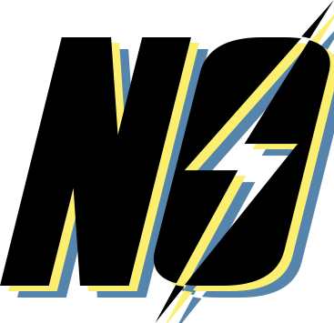

 

  
  <h3 align="center">Nukout</h3>
  
You are currently reading the bot documentation, happy reading :)

 

# Nukout Discord BOT
Nukout is a gaming and versatile Discord bot designed to play on Discord has a shelter manager! Inspired by the famous game: Fallout Shelter, create your abi, manage it, produce it and become the best supervisor of Nukout-Tech !

 

# Shelter
Play Shelter !

Produce resources and earn money, expand your shelter, watch out for enemies and much more!

Nukout is a gaming Discord bot inspired by the world of the famous video game: Fallout Shelter.

 

# Usage
Currently, Nukout is in full creation, so it is impossible to add it to your server !

 

# Protecting Sensitive Data
We do not share the code or procedures used to run Nukout, as only the Nukout team is authorized to have access to them.

 

### Thank you for choosing Nukout as your Discord bot ! We hope it brings joy and excitement to your server.
